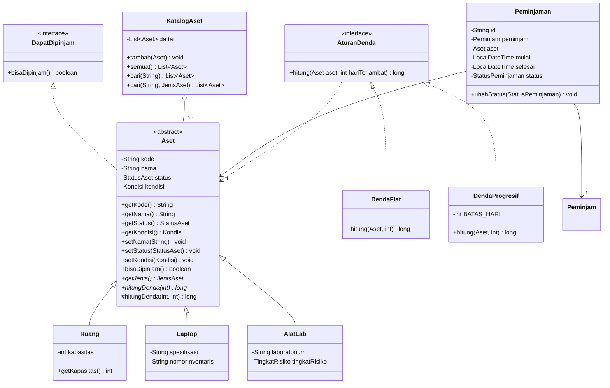

# Class Diagram

```mermaid
classDiagram
    direction TB

    class DapatDipinjam {
        <<interface>>
        +bisaDipinjam() boolean
    }
    class AturanDenda {
        <<interface>>
        +hitung(Aset aset, int hariTerlambat) long
    }

    class Aset {
        <<abstract>>
        -String kode
        -String nama
        -StatusAset status
        -Kondisi kondisi
        +getKode() String
        +getNama() String
        +getStatus() StatusAset
        +getKondisi() Kondisi
        +setNama(String) void
        +setStatus(StatusAset) void
        +setKondisi(Kondisi) void
        +bisaDipinjam() boolean
        +getJenis()* JenisAset
        +hitungDenda(int)* long
        #hitungDenda(int, int) long
    }
    class Ruang {
        -int kapasitas
        +getKapasitas() int
    }
    class Laptop {
        -String spesifikasi
        -String nomorInventaris
    }
    class AlatLab {
        -String laboratorium
        -TingkatRisiko tingkatRisiko
    }

    class DendaFlat {
        +hitung(Aset, int) long
    }
    class DendaProgresif {
        -int BATAS_HARI
        +hitung(Aset, int) long
    }

    class KatalogAset {
        -List~Aset~ daftar
        +tambah(Aset) void
        +semua() List~Aset~
        +cari(String) List~Aset~
        +cari(String, JenisAset) List~Aset~
    }

    class Peminjaman {
        -String id
        -Peminjam peminjam
        -Aset aset
        -LocalDateTime mulai
        -LocalDateTime selesai
        -StatusPeminjaman status
        +ubahStatus(StatusPeminjaman) void
    }
    class Peminjam

    DapatDipinjam <|.. Aset
    Aset <|-- Ruang
    Aset <|-- Laptop
    Aset <|-- AlatLab
    AturanDenda <|.. DendaFlat
    AturanDenda <|.. DendaProgresif

    KatalogAset o-- "0..*" Aset
    Peminjaman --> "1" Aset
    Peminjaman --> "1" Peminjam
    AturanDenda ..> Aset
```

Paket: `kontrak` (DapatDipinjam, AturanDenda), `model` (Aset, Ruang, Laptop, AlatLab, Peminjam, Peminjaman, enum), `denda` (DendaFlat, DendaProgresif), `katalog` (KatalogAset).