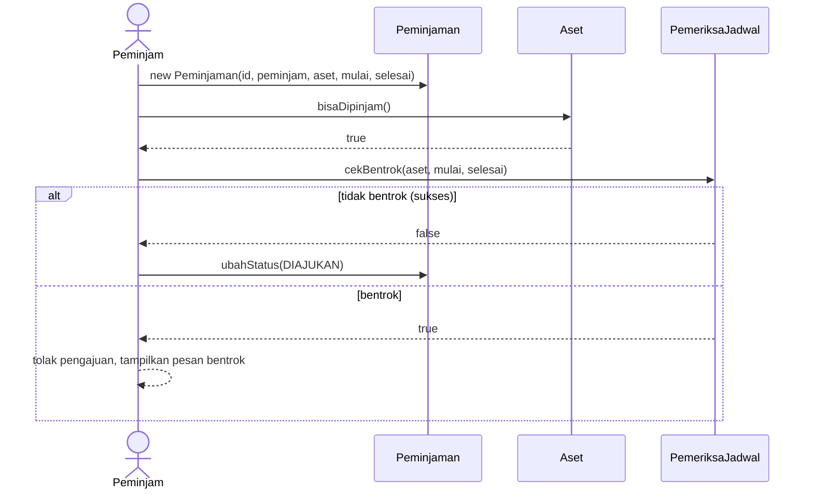

# Sequence Diagram: Pengajuan Peminjaman

```mermaid
sequenceDiagram
    actor U as Peminjam
    participant P as Peminjaman
    participant A as Aset
    participant J as PemeriksaJadwal

    U->>P: new Peminjaman(id, peminjam, aset, mulai, selesai)
    U->>A: bisaDipinjam()
    A-->>U: true
    U->>J: cekBentrok(aset, mulai, selesai)

    alt tidak bentrok (sukses)
        J-->>U: false
        U->>P: ubahStatus(DIAJUKAN)
    else bentrok
        J-->>U: true
        U-->>U: tolak pengajuan, tampilkan pesan bentrok
    end
```